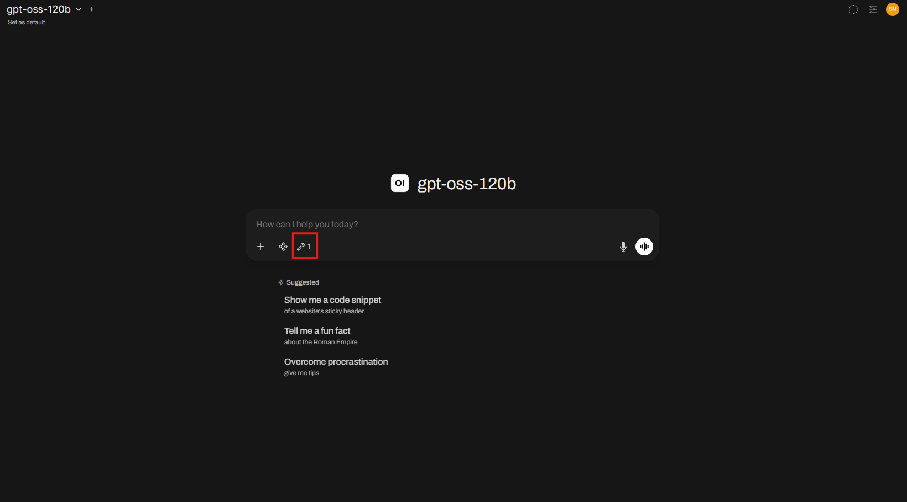

# Local Chat Assistant with JetStream-hosted LLM and ACCESS MCP Servers

## Overview

This is a tutorial on using the LLMs hosted on JetStream with integration of ACCESS MCP Servers. For this tutorial, we will be using a chat interface hosted locally.

Note that to follow up with this tutorial, you need to have a valid ACCESS account as it's required for getting an API key for the LLM.

## Generate an API key for JetStream-hosted LLM

Let's start with generating an API key for the LLM [[1](#references)]. For this, you will need to log in using the ACCESS account.

1. Open the [JetStream Chat Interface](https://llm.jetstream-cloud.org/) hosted in JetStream. Login using the ACCESS SSO with the "ACCESS CI (XSEDE)" identity provider.

2. Once logged in, you can chat with the LLMs. To generate an API key, click on your profile avatar in the top-right corner of the screen to open the dropdown menu, then click **Settings**.

3. In the Settings menu, navigate to **Accounts** where you can generate a new API key. Copy this key; you will need it later to configure your local assistant.

## Local Chat Assistant Setup

Now that you have your API key for for the JetStream-hosted LLM, let's setup a local chat interface using Open Web-UI [[2](#references)].

While there are different ways to run an Open Web-UI chat assistant on local machine, this tutorial guides you through installing and running it using Python.

> **Note:** This tutorial assumes you have compatible version of Python installed. At the time of writing, Open WebUI supports Python versions 3.11 and 3.12.

1. Verify that you have a compatible Python version installed:

```bash
python --version
```

2. Create a vitural environment and activate it:

```bash
python -m venv .venv
```

- If you are on Linux or MacOS:

```bash
source .venv/bin/activate
```

- if you are on Windows:

```bash
source .venv/Scripts/activate
```

3. Install Open WebUI.

```bash
pip install open-webui
```

4. Start the server.

```bash
open-webui serve
```

Once started, Open WebUI will be running locally at http://localhost:8080.

## Configure the JetStream-hosted LLMs

With your local Open WebUI chat interface running and your JetStream API key ready, follow these steps to connect them:

1. Open http://localhost:8080 in your browser. (If you are a first-time user, you will need to register a local admin account.)

2. Access the Admin Panel by clicking on your profile avatar in the top-right corner of the screen, and select **Admin Panel**. Within the Admin Panel, navigate to the **Settings** tab.

3. Select the **Connections** sub-tab. Under the OpenAI API Connections, click the `+` on the right to add a connection. Fill the fields with the following values:

```txt
URL: https://llm.jetstream-cloud.org/api
Auth Key (Keep it Bearer): <Your copied JetStream API Key>
```

4. Click **Save** to apply the connection. To verify, go to the **Models** section where you should now see the available JetStream models, such as `gpt-oss-120b` and `Llama 4 Scout`.

Congratulations! You have configured your local chat assistant to use JetStream-hosted LLMs. You can now start chatting with them.

## Using MCP Servers

The ACCESS-CI project hosts Model Context Protocol (MCP) Servers that you can connect your AI assistant with. With the tools provided by these MCP servers, your assistant can directly query relevant ACCESS services and answer questions about ACCESS-CI resources without you needing to navigate through multiple websites manually [[3](#references)].

Most of the ACCESS-CI MCP Servers work without authentication. For this tutorial, you will connect to "compute-resources" server, which provides tools to search for and retrieve information about ACCESS computing infrastructure. If you'd like to explore other available ACCESS-CI MCP servers, you can find them on the [ACCESS MCP Getting Started Page](https://mcp.access-ci.org/docs/getting-started.html).

To add the MCP Server to your Open WebUI assistant:

1. Go to the **Admin Panel** and navigate to the **Integrations** tab.

2. Click the `+` button on the right next to the MCP section to add a connection.

3. In the setup dialog, set the **Type** to **MCP Streamable HTTP** by clicking on the default value (OpenAI).

4. Fill in the form with the following details:

```txt
Name: access-compute-resources (or any other name you want)
id: compute-resources
URL: https://mcp.access-ci.org/compute-resources/mcp
```

5. Select **None** for **Auth**, as this server does not require authentication.

6. Click **Save**.

The MCP Server is now configured in your assistant. Next, you need to grant your model access to these tools:

1. Naviate to the **Settings** within the **Admin Panel** and go to **Models**.

2. Click the **Edit** (pencil) button on the model you want to grant tool access to (e.g., gpt-oss-120b).

3. Locate the **Tools** section and check boxes to enable the registered MCP tools for this model.

4. Next, expand the **Advanced Params** section. Find the **Function Calling** parameter and switch it from Default to Native.

5. Click **Save & Update**.

The MCP tools are now ready to be used by the model. You can confirm this by checking the active tools icon right below the chat input field.



Congratulations! You can successfully configured the MCP server and enabled its tools for your model.

## References

[1] JetStream Cloud Chat Inference Service APIs https://docs.jetstream-cloud.org/inference-service/api/

[2] Open WebUI Project https://docs.openwebui.com/

[3] ACCESS Model Context Protocol (MCP) Documentation https://mcp.access-ci.org/docs/getting-started.html
